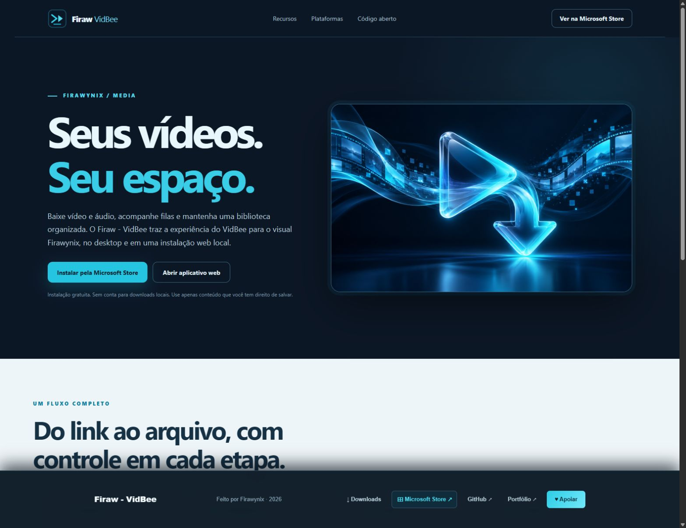

# Firaw - VidBee — Video download

Aplicativo desktop Windows e aplicativo web local com identidade Firawynix. Baseado no [VidBee de nexmoe](https://github.com/nexmoe/VidBee), sob licença MIT. Mantém downloads de vídeo e áudio, filas, histórico, assinaturas RSS, biblioteca de mídia e recursos de transcrição do projeto original.



## Instalar e usar

- [Microsoft Store](https://apps.microsoft.com/detail/9P7LKC7HF335): edição Windows gratuita.
- [Site local](site/README.md): apresentação, acesso ao aplicativo web e pacotes Windows gerados neste computador.
- Aplicativo web: `pnpm run start:web`, depois abra <http://localhost:3000/>.
- Desktop em desenvolvimento: `pnpm run dev`.

O site local pode ser aberto com `python -m http.server 4175 --bind 127.0.0.1 --directory site/dist` e estará em <http://localhost:4175/>. Os pacotes Windows não fazem parte do repositório; são gerados em `apps/desktop/dist/` com `pnpm run build:win`.

## Desenvolvimento

Requer Node.js, pnpm 11.1.2 e as dependências do projeto original. Após instalar as dependências com `pnpm install`:

```powershell
pnpm run check
pnpm run check:web
pnpm run build:web
```

O [guia original do VidBee](docs/upstream/README.md) permanece disponível para os detalhes dos recursos e da arquitetura. As [informações da Microsoft Store](store/README.md) e a [política de privacidade](site/dist/privacidade.html) estão neste repositório.

## Créditos e licença

Firaw - VidBee adapta o [VidBee](https://github.com/nexmoe/VidBee) de nexmoe. Consulte a [licença MIT](LICENSE) e preserve os avisos de terceiros. `yt-dlp` e `FFmpeg` mantêm suas próprias licenças. Use downloads apenas quando tiver direito de salvar o conteúdo.
